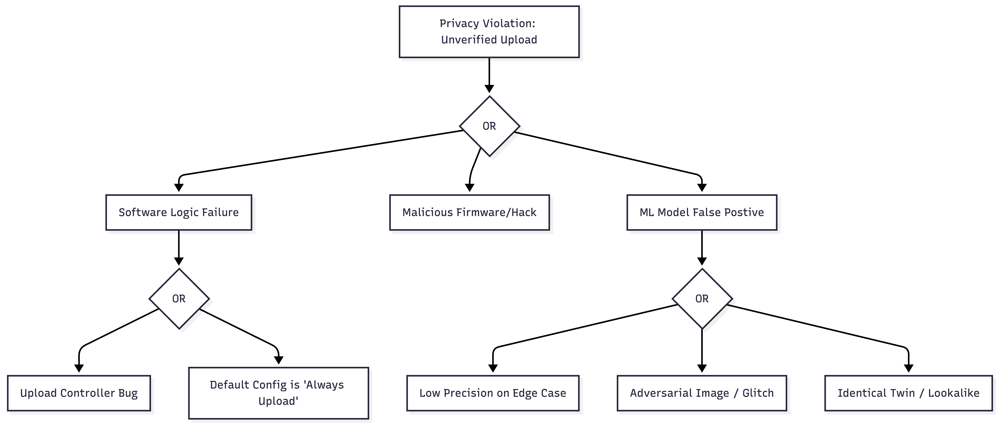
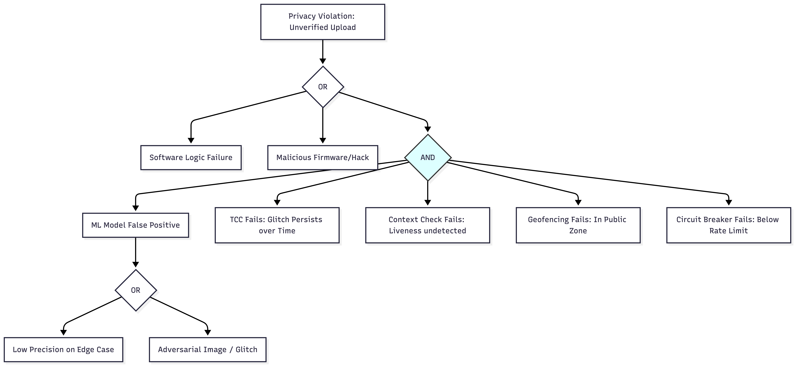

# Fault Tree Analysis

## Selected Requirement
From `key_results.md`, we analyze **REQ-01**:
> The system shall not upload video or location data unless a confirmed match is locally detected.

This requirement safeguards the User Value of **Privacy**. A violation results in unauthorized surveillance or tracking of innocent drivers.

## 1. Initial Fault Tree
The top event is **"Privacy Violation: Unverified Video Uploaded"**.
This can occur due to logic errors, malicious acts, or most importantly, the AI Model incorrectly flagging a match (False Positive).

## 2. Mitigation Strategies

We propose two system-level strategies to mitigate the risk of Privacy Violation caused by ML False Positives.

### Mitigation 1: Temporal Consistency Check (TCC)
**Description**: Instead of triggering an upload on a single frame match, the system requires the target face to be detected and matched in at least $N$ consecutive frames (e.g., 5 frames) or over a time window of $T$ seconds.
**Risk Reduction**: This filters out "glitch" false positives caused by lighting artifacts, motion blur, or single-frame adversarial patterns. It drastically reduces the probability of a false positive, as $P(FP_{sequence}) \approx P(FP_{single})^N$.

### Mitigation 2: Geometric/Contextual Verification
**Description**: Use a secondary, deterministic algorithm (non-AI) or a separate lightweight model to verify that the bounding box actually contains a valid face structure with expected geometry (two eyes, nose) and is not a picture-of-a-face (liveness check) before trusting the ID match.
**Risk Reduction**: This prevents uploads triggered by non-face objects (pareidolia) or photos on billboards/T-shirts, which are common sources of false positives in street environments.

### Mitigation 3: Upload Circuit Breaker (Rate Limiting)
**Description**: The system enforces a strict upload limit per device (e.g., max 1 match per 10 minutes). If the ML model "glitches" and starts flagging every pedestrian, the circuit breaker trips, blocking further uploads and alerting the user/logs locally.
**Risk Reduction**: This mitigates the risk of "runaway" false positives causing mass surveillance or DoS attacks. It ensures that even a catastrophic model failure cannot leak large amounts of video data.

### Mitigation 4: Operational Geofencing
**Description**: The search feature is automatically disabled when the vehicle is in "Private Zones" (e.g., GPS coordinates of the owner's home/driveway) or when the vehicle is stationary for > 5 minutes (parking mode), unless manually overridden.
**Risk Reduction**: This reduces privacy risks by ensuring the system only records/uploads in public contexts where expectation of privacy is lower, preventing accidental uploads of family members or private property.

## 3. Mitigated Fault Tree
The Fault Tree is updated. The "ML Model False Positive" event now requires *simultaneous* failure of the primary recognition AND the mitigation checks (AND gate).

By adding the mitigations, we change the structure from a direct OR gate to an AND gate for the ML failure branch, significantly lowering the probability of the Top Event.
