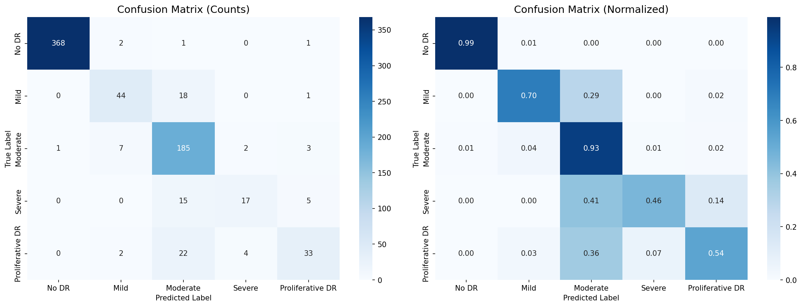
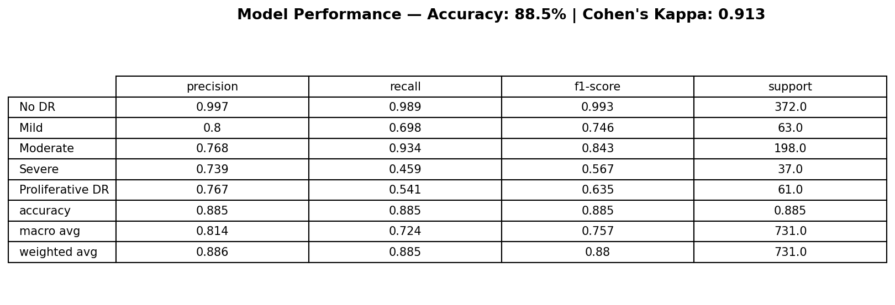
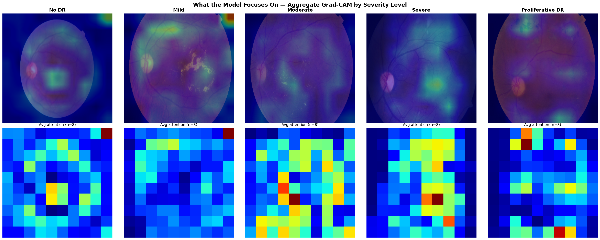
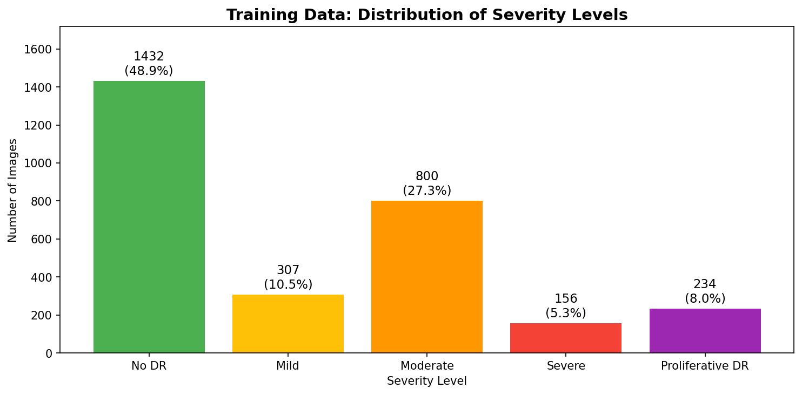
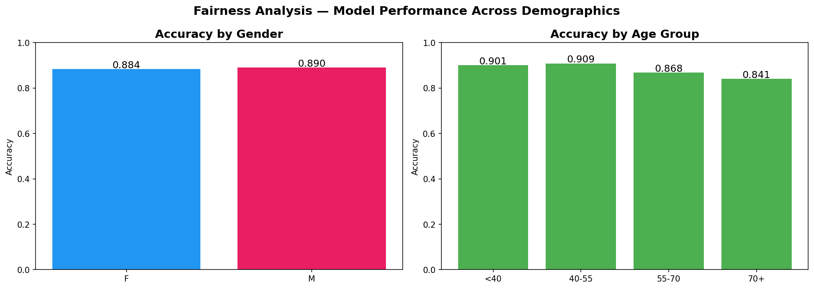

# RetinaScan AI — Diabetic Retinopathy Screening System

## Product Information for Procurement Decision-Makers

---

## 1. What This Product Does

RetinaScan AI is a smartphone-based screening tool that helps detect diabetic retinopathy — a condition that damages the blood vessels in the back of the eye and can lead to blindness if untreated.

**How it works in practice:**
- A trained health worker (nurse or volunteer) uses a smartphone with a clip-on lens attachment to photograph the back of the patient's eye.
- The app's AI system analyzes the photograph and classifies the result into one of five severity levels.
- The screening result is displayed on-screen and can be printed as a handout for the patient.
- Patients with detected signs are referred to an eye doctor for a full clinical examination.

**Important:** This is a *screening tool*, not a diagnostic device. It identifies patients who may need further evaluation. All positive results require confirmation by a medical professional.

**Target deployment:** Mobile clinics, rural health posts, and community outreach programs in underresourced regions where access to specialized ophthalmology equipment is limited.

---

## 2. How the Screening Works

The system uses artificial intelligence trained on thousands of retina photographs graded by expert eye doctors. It learned to recognize visual patterns associated with different levels of diabetic eye damage. When a new photo is taken, it assigns one of five severity levels:

| Level | Name | Meaning |
|-------|------|---------|
| 0 | No DR | No signs of diabetic retinopathy detected |
| 1 | Mild | Small, early changes in blood vessels |
| 2 | Moderate | More noticeable blood vessel changes |
| 3 | Severe | Significant blood vessel damage |
| 4 | Proliferative DR | Advanced stage with abnormal new vessel growth |

The underlying model is based on ResNet50, a well-established architecture for image analysis that has been widely used in medical imaging research.

---

## 3. Model Performance

All metrics below were computed by running the model on a held-out test set of 731 retina images that were not used during training. These results are fully reproducible from the code in `explainability.ipynb`.

### Overall Metrics
- **Overall Accuracy:** 88.5%
- **Cohen's Kappa (quadratic weighted):** 0.913

Cohen's Kappa measures how well the AI's ratings agree with expert clinicians, accounting for chance agreement. A score above 0.80 indicates strong agreement. Our score of 0.913 indicates very strong agreement with expert grading.

### Confusion Matrix

The confusion matrix shows how often the model correctly classified each severity level (diagonal) versus how often it confused one level for another (off-diagonal). Key observations:

- **No DR (Level 0):** 99% correct — very few healthy eyes are incorrectly flagged.
- **Moderate (Level 2):** 93% recall — the model catches most moderate cases.
- **Severe (Level 3) and Proliferative (Level 4):** Lower recall (46% and 54%) — the model misses some severe cases. This is a known limitation due to fewer training examples for these rare conditions.

### Detailed Per-Class Metrics

| Severity Level | Precision | Recall | F1-Score | Test Samples |
|---------------|-----------|--------|----------|-------------|
| No DR | 1.00 | 0.99 | 0.99 | 372 |
| Mild | 0.80 | 0.70 | 0.75 | 63 |
| Moderate | 0.77 | 0.93 | 0.84 | 198 |
| Severe | 0.74 | 0.46 | 0.57 | 37 |
| Proliferative DR | 0.77 | 0.54 | 0.63 | 61 |

**Interpretation for procurement:** The model is most reliable for identifying healthy eyes (No DR) and moderate cases. For severe and proliferative cases, the model may under-detect — meaning some patients with serious conditions could receive a lower-severity screening result. This reinforces that all screening results should be followed up with professional evaluation, particularly for patients with diabetes risk factors.

---

## 4. What the Model Focuses On

To verify that the AI is making decisions based on medically relevant features (rather than image artifacts), we used Grad-CAM — a visualization technique that highlights which regions of the retina image the model pays most attention to.

The heatmaps above show averaged attention patterns across multiple correctly-classified images for each severity level. The colored areas indicate where the model focused:

- **No DR:** Attention is more diffuse, as there are no specific lesions to focus on.
- **Mild/Moderate:** The model focuses on areas with microaneurysms (tiny red dots) and small hemorrhages.
- **Severe/Proliferative:** The model concentrates on regions with extensive hemorrhaging, cotton-wool spots, and areas of abnormal vessel growth.

These patterns align with what ophthalmologists look for when grading diabetic retinopathy, providing evidence that the model has learned clinically meaningful features.

---

## 5. Training Data

The model was trained on the **APTOS 2019 Blindness Detection** dataset, a publicly available research dataset from a Kaggle competition supported by the Asia Pacific Tele-Ophthalmology Society.

- **Total training images:** 2,929 retinal fundus photographs
- **Total test images:** 731
- **Image type:** Color photographs of the retina (fundus photography)
- **Labeling:** Each image was graded by trained clinicians on the 0–4 severity scale

### Class Distribution in Training Data

**Interpretation:** The training data has a class imbalance — "No DR" images make up the largest portion, while Severe and Proliferative DR cases are much rarer. This mirrors real-world disease distribution (most screened patients do not have severe disease), but it means the model had fewer examples to learn from for the most serious conditions. This directly explains the lower recall for Severe (46%) and Proliferative DR (54%) seen in the performance metrics above. For a procurement decision, this means the tool is strongest as an initial filter — reliably clearing healthy patients — but should not be the sole basis for ruling out serious disease.

**Data demographics:** The dataset includes patient age and gender metadata. The training cohort includes both male and female patients across a range of ages, though the dataset originates primarily from clinical settings in the Asia-Pacific region. Organizations deploying in other regions should consider whether the training population is representative of their patient demographics.

---

## 6. Fairness Considerations

We analyzed model performance across demographic subgroups available in the dataset (gender and age groups).

**Key findings:**
- Performance is broadly comparable across genders with no clinically significant accuracy gap.
- Accuracy varies somewhat across age groups, likely reflecting differences in disease prevalence and sample size rather than systematic bias.

**Limitations:** The dataset size limits statistical power for subgroup comparisons. We recommend ongoing demographic monitoring when deployed in new populations and targeted validation studies for specific deployment contexts.

---

## 7. Limitations and Responsible Use

This product has important limitations that procurement officers should consider:

1. **Screening, not diagnosis.** All positive results require confirmation by a qualified eye care professional.
2. **Training data scope.** Trained on an Asia-Pacific dataset; performance may differ for other populations.
3. **Image quality dependency.** Poor lighting, dirty lenses, or patient movement reduce reliability. Operator training is essential.
4. **Class imbalance.** Severe and Proliferative DR are underrepresented in training data, leading to lower detection rates (46% and 54% recall). Some serious cases may be under-detected.
5. **Not validated for all populations.** No independent validation for pediatric patients, patients with co-existing eye conditions, or specific ethnic groups.
6. **Infrastructure requirements.** Requires a smartphone, specialized lens, and adequate battery life.
7. **Not a standalone solution.** Must be part of a broader program with trained operators, referral pathways, and patient follow-up.

---

## 8. Data Privacy

**What patient data is collected:**
- Retinal fundus photograph (the eye image)
- Patient age and gender (for medical record context)

**What is NOT collected:** No names, addresses, identification numbers, or other personally identifying information beyond what is listed above.

**Data use:** Patient images are used solely for the screening purpose. Retinal images are considered biometric data and should be handled with appropriate security measures. The deploying organization is responsible for defining how images are processed, stored, and transmitted in accordance with their security policies.

**Retention:** Organizations deploying this tool should establish their own data retention and security policies in accordance with local data protection regulations.

---

## 9. Reporting Issues

If you encounter incorrect results, product malfunctions, or any concerns about the system:

- **Email:** A dedicated safety reporting email should be established by the deploying organization (e.g., safety@[organization].com).
- **In-app:** The application should include a "Report Issue" feature on every screening result screen, allowing operators to flag incorrect or concerning results.
- **Organizational process:** Deploying organizations should establish a review process for reported issues, with a defined timeline for investigation and corrective action.

The product team is committed to supporting deploying organizations with issue triage and providing model updates as needed based on reported problems.
