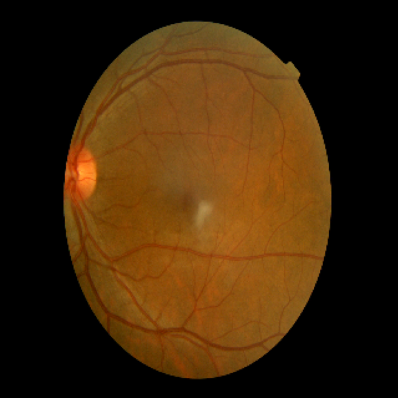
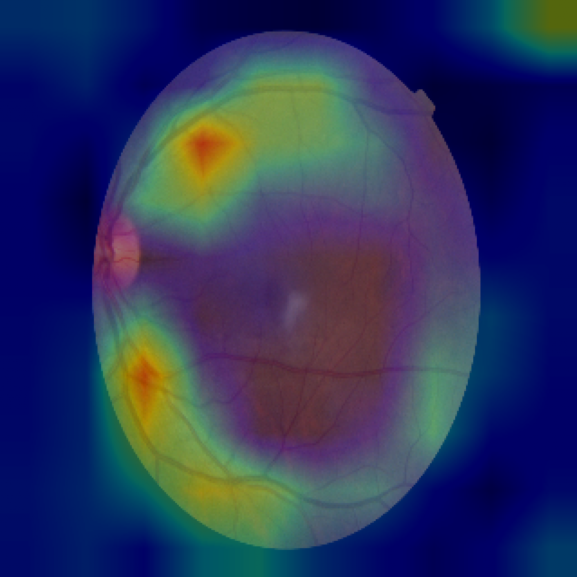
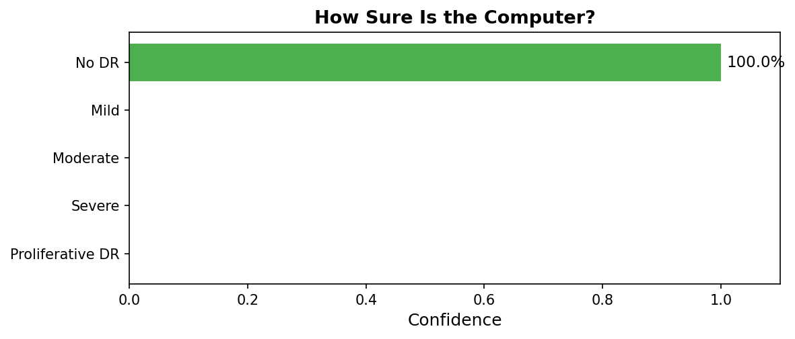
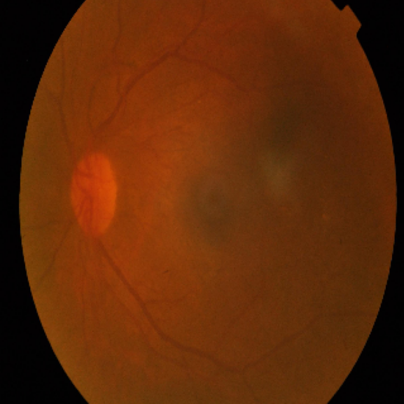
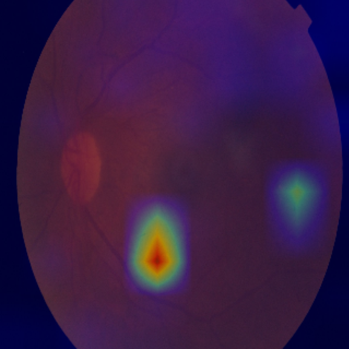
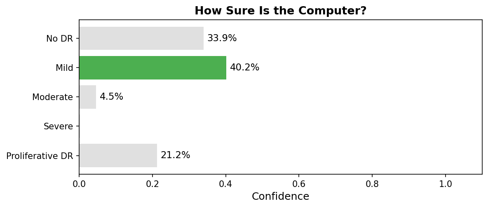

# Individual Screening Result Reports

These reports are designed for **nurses and volunteers** who perform diabetic retinopathy screenings. Each report is generated after a screening and can be displayed on-screen or printed as a handout. The nurse uses this report to (1) understand the screening result, (2) explain it to the patient in plain language, and (3) decide on the appropriate referral action.

---

## Patient 1: dd90c321d7bc

**Patient Information:** Age 71, Female

**Notice for the health worker:** This screening was performed by a computer program (AI), not a doctor. Please communicate this to the patient and emphasize that a doctor should confirm the result.

### How This Screening Works
*Read or paraphrase this to the patient:*

A photo was taken of the back of the patient's eye using a smartphone with a special lens. A computer program analyzed the photo for signs of blood vessel damage that can be caused by diabetes.

### Who Is Involved in This Decision

- **You** (the health worker) took the eye photo.
- **A computer program** analyzed it.
- **A doctor** should confirm the result before any treatment decisions.

### What Data Was Used

The computer used **only the eye photo** to produce the screening result. The model does not use the patient's age or gender for its analysis. Age and gender are recorded in the patient's medical file for clinical context only.

### Eye Photo and Computer Focus Area

| Patient's eye photo | Where the computer focused |
|:-:|:-:|
|  |  |

The colored areas in the right image show where the computer looked most closely. Red and yellow indicate areas of higher attention.

### Screening Result: No DR

The screening did not find signs of diabetic eye damage. This is a good result.

### Computer Confidence

The computer gave this result its highest score (100 out of 100). This suggests the result is likely correct, but a doctor should still confirm.

### Recommended Action
*Communicate the following to the patient:*

Keep up with your regular health checkups. If you have diabetes, have your eyes checked at least once a year. Eating well and managing your blood sugar can help keep your eyes healthy.

---

**Reminder:** This is a screening tool only. It does not replace a full eye exam by a doctor. Please refer the patient to a medical professional for a complete evaluation.

---

## Patient 2: 75a4343b12f9

**Patient Information:** Age 22, Female

**Notice for the health worker:** This screening was performed by a computer program (AI), not a doctor. Please communicate this to the patient and emphasize that a doctor should confirm the result.

### How This Screening Works
*Read or paraphrase this to the patient:*

A photo was taken of the back of the patient's eye using a smartphone with a special lens. A computer program analyzed the photo for signs of blood vessel damage that can be caused by diabetes.

### Who Is Involved in This Decision

- **You** (the health worker) took the eye photo.
- **A computer program** analyzed it.
- **A doctor** should confirm the result before any treatment decisions.

### What Data Was Used

The computer used **only the eye photo** to produce the screening result. The model does not use the patient's age or gender for its analysis. Age and gender are recorded in the patient's medical file for clinical context only.

### Eye Photo and Computer Focus Area

| Patient's eye photo | Where the computer focused |
|:-:|:-:|
|  |  |

The colored areas in the right image show where the computer looked most closely. Red and yellow indicate areas of higher attention.

### Screening Result: Mild

The screening found mild signs of diabetic eye damage. This means there may be small changes in the blood vessels in your eye.

### Computer Confidence

The computer gave this result a low score (40 out of 100). The computer was not very certain, so please see a doctor for a full exam to confirm.

### Recommended Action
*Communicate the following to the patient:*

Please see an eye doctor for a full eye exam. Early changes were found, and a doctor can tell you more. Keep managing your blood sugar and attend regular checkups.

---

**Reminder:** This is a screening tool only. It does not replace a full eye exam by a doctor. Please refer the patient to a medical professional for a complete evaluation.

---
